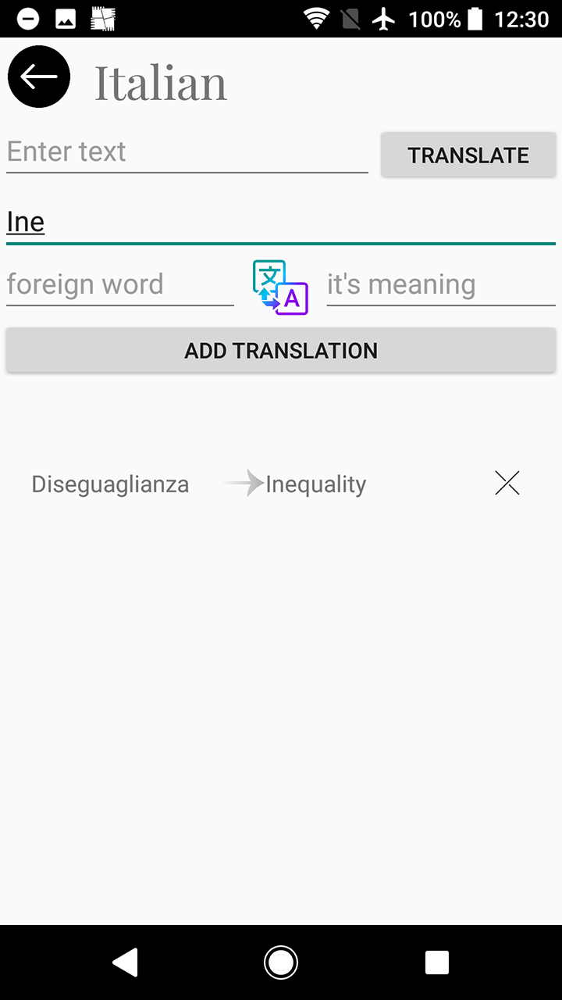

# Dictio
An android app made as a dictionary for learning languages.

# The idea behind the app
Since I'm studying Italian, I have a small dictionary in which I write new 
words that I'm supposed to learn, so I thought it would be useful if I had a 
phone app on which I could translate them, and add them to the dictionary 
right away. Boom Dictio was invented. As the name suggests it's a shorter 
version of the word Dictionary. 

# App's possibilities
The app offers predefined empty language dictionaries which have the translate 
feature. Those languages can't be deleted. On the other hand we have the freedom 
to define our own custom dictionaries. You can choose a name, picture and you can 
also delete them, but they don't have the translation functionality. Inside of 
dictionaries you will find that you can add new foreign words and their translation 
as well as delete them. For the predefined languages you can translate a word and add 
it right away to the dictionary. 

# Setting up the translator
I've used libretranslate API for my app because I haven't found any free online API's 
for translation(or I haven't searched long enough >:) ).
To setup libretranslate you're gonna have to download it from their github page: 
https://github.com/LibreTranslate/LibreTranslate 
and then install it using python:  
pip install libretranslate  
I had to manually find the folder of the installation and run the API using:  
python main.py  
where it did some downloads and the API was up and running on http://localhost:5000/translate 

# The App itself
The icon

Splash Screen

Dictionaries screen

Adding a custom dictionary

Custom dictionaries page

Translating a word in a predefined language

Adding a term to the dictionary

Term added

Terms page

Searching for a term

A custom dictionaries term screen

Deleting a custom dictionary

Confirmation of deletion for the custom dictionary

Confirmation of deletion for a term

